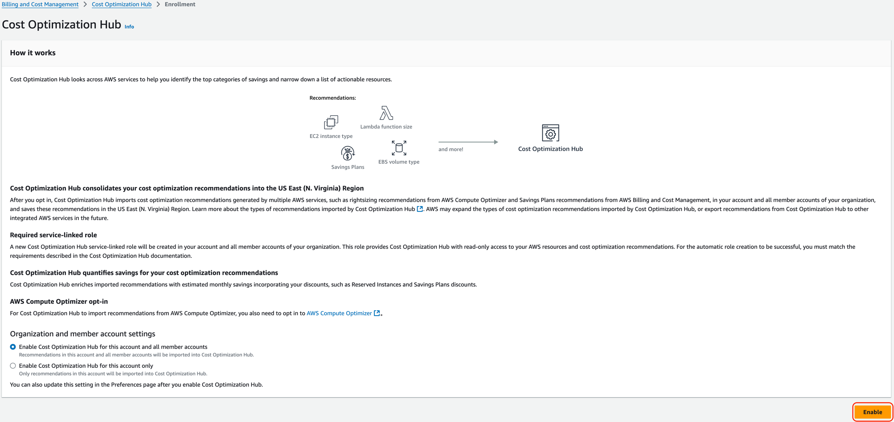
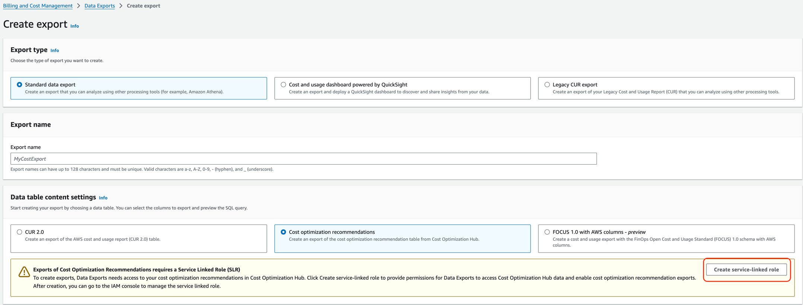

# Terraform module to provide Vertice Cloud Cost Optimization service with access to your AWS accounts

This module handles creating a role to be used by Vertice Cloud Cost Optimization service to access your AWS account and access required services and data within it.

## Usage

If the account is your AWS Management account you should configure a [Cost and Usage Reports (CUR)](https://docs.aws.amazon.com/cur/latest/userguide/what-is-cur.html) export, and then provide the `cur_bucket_name` variable to allow the role access to the CUR data within S3.

You can now configure a [Cost Optimization Recommendations Report (COR)](https://docs.aws.amazon.com/cur/latest/userguide/dataexports-create-standard.html) export, use existing bucket for [Cost and Usage Reports (CUR)](https://docs.aws.amazon.com/cur/latest/userguide/what-is-cur.html) `cur_bucket_name` and provide `cor_report_s3_prefix` variable.

> [!IMPORTANT]
> Before enabling an AWS Data Export report (COR format) through this template:
> * Enable **Cost Optimization Hub** in **Billing and Cost Management** in your **Billing AWS Account**:
> 
> * Create the **AWSServiceRoleForBCMDataExports** service-linked role
>   * In the AWS Console, go to the **Billing and Cost Management** page
>   * On this page navigate to **Data Exports** -> Click **Create** -> Select **Standard data export** and **Cost optimization recommendations**
>   * Now you should see a warning table with the following title: **Exports of Cost Optimization Recommendations requires a Service Linked Role (SLR)**
>      * If you don't see the warning, you have already created the **AWSServiceRoleForBCMDataExports** service-linked role.
>   * In this warning table, click the **Create service-linked role** button, and it will create the necessary role for you.
>   * You can leave the page now, without finishing the creation of the Data export, or you can continue with the settings below
> 

## Configure access for your AWS Management Account with Cost and Usage Reports (CUR) and Cost Optimization Recommendations (COR) export configured

This is an example of creating a role in your [AWS Organizations management](https://docs.aws.amazon.com/organizations/latest/userguide/orgs_getting-started_concepts.html) account (root/payer) where you host your CUR reports in a S3 bucket which will be accessed by the Vertice cross-account IAM role.

Configuring this module to create CUR S3 bucket and CUR report in your AWS Organizations management (root/payer) account is highly recommended. If you want to use the Cost Optimization Recommendations (AWS Data Exports) report, please configure this module to create the export in your AWS Organizations management (root/payer) account using the `data_export_enabled` variable.

For the governance IAM role to be created in your account, an ExternalId needs to be set in the `governance_role_external_id` parameter. You will receive this value from Vertice.

Please note that an `aws.us-east-1` provider alias needs to be defined, since Cost and Usage Reports are only supported by AWS in that region.

```hcl
data "aws_caller_identity" "current" {}

module "vertice_cco_integration_role" {
  source        = "git::https://github.com/VerticeOne/terraform-aws-vertice-integration.git?ref=<release-version>"

  account_type = "combined"
  cur_bucket_enabled = true
  cur_report_enabled = true

  billing_policy_addons = {
    # allow managing EC2 Reserved Instances in billing policy
    ec2_ri = true
  }

  cur_bucket_name = "vertice-cur-reports-athena-${data.aws_caller_identity.current.account_id}"

  cur_report_name      = "athena"
  cur_report_s3_prefix = "cur"
  # If you want to enable Cost Optimization Recommendations report, you need to add lines below
  # COR section start
  cor_report_enabled         = true
  cor_report_name            = "vertice-cor-reports"
  # COR section end
  governance_role_external_id = "<provided ExternalId value>"

  providers = {
    aws = aws

    aws.us-east-1 = aws.us-east-1
  }
}

provider "aws" {
  region = "us-west-2" # Replace with desired region for the CUR S3 bucket
}

# Cost and Usage Report only exists in us-east-1
provider "aws" {
  alias  = "us-east-1"
  region = "us-east-1"
}

terraform {
  required_version = ">= 1.3.0"
  required_providers {
    aws = {
      source  = "hashicorp/aws"
      version = ">= 4.64.0"

      # A provider alias for us-east-1 region is needed because CUR is available only there.
      configuration_aliases = [
        aws,
        aws.us-east-1
      ]
    }
  }
}
```

### Split Cost Allocation Data

The module supports the [Split Cost Allocation Data](https://aws.amazon.com/blogs/aws-cloud-financial-management/improve-cost-visibility-of-amazon-eks-with-aws-split-cost-allocation-data/) opt-in feature of the Cost and Usage Report, which provides more granular data for ECS/EKS usage. Please note that this feature may increase your costs slightly due to a larger volume of usage data generated.

To enable this feature:
1. Opt in to Split Cost Allocation Data in the [Cost Management Preferences](https://us-east-1.console.aws.amazon.com/costmanagement/home?region=eu-west-1#/settings) page of the AWS Console (Step 1 of the guide above).
2. Set the `cur_report_split_cost_data = true` variable on this module.

<!-- markdownlint-disable -->
<!-- BEGIN_TF_DOCS -->
## Requirements

| Name | Version |
|------|---------|
| <a name="requirement_terraform"></a> [terraform](#requirement\_terraform) | >= 1.3.0 |
| <a name="requirement_aws"></a> [aws](#requirement\_aws) | >= 5.64.0, < 6.0.0 |

## Providers

No providers.

## Inputs

| Name | Description | Type | Required |
|------|-------------|------|:--------:|
| <a name="input_account_type"></a> [account\_type](#input\_account\_type) | The type of the AWS account. The possible values are `billing`, `member` and `combined`.<br>Use `billing` if the target account is only for billing purposes (generating CUR report and exporting it to Vertice via S3 bucket).<br>Use `member` if the account contains active workload and you want to allow `VerticeGovernance` role to perform spend optimization actions in the account on your behalf.<br>Use `combined` for both of the above. | `string` | yes |
| <a name="input_billing_policy_addons"></a> [billing\_policy\_addons](#input\_billing\_policy\_addons) | Enable optional add-ons for the `billing`/`combined` account IAM policy. | <pre>object({<br>    elasticache_ri = optional(bool, true),<br>    ec2_ri         = optional(bool, true),<br>    es_ri          = optional(bool, true),<br>    rds_ri         = optional(bool, true),<br>    redshift_ri    = optional(bool, true),<br>  })</pre> | no |
| <a name="input_cur_bucket_enabled"></a> [cur\_bucket\_enabled](#input\_cur\_bucket\_enabled) | Whether to enable the module that creates S3 bucket for Cost Usage Report data. | `bool` | no |
| <a name="input_cur_bucket_force_destroy"></a> [cur\_bucket\_force\_destroy](#input\_cur\_bucket\_force\_destroy) | A boolean that indicates all objects should be deleted from the bucket so that the bucket can be destroyed without error. These objects are not recoverable. | `bool` | no |
| <a name="input_cur_bucket_lifecycle_rules"></a> [cur\_bucket\_lifecycle\_rules](#input\_cur\_bucket\_lifecycle\_rules) | List of maps containing configuration of object lifecycle management on the S3 bucket holding CUR data. | `any` | no |
| <a name="input_cur_bucket_name"></a> [cur\_bucket\_name](#input\_cur\_bucket\_name) | The name of the bucket which will be used to store the CUR data for Vertice. | `string` | no |
| <a name="input_cur_bucket_versioning"></a> [cur\_bucket\_versioning](#input\_cur\_bucket\_versioning) | Map containing versioning configuration on the S3 bucket holding CUR data. | `map(string)` | no |
| <a name="input_cur_report_enabled"></a> [cur\_report\_enabled](#input\_cur\_report\_enabled) | Whether to enable the module that creates S3 bucket for Cost Usage Report data. | `bool` | no |
| <a name="input_cur_report_name"></a> [cur\_report\_name](#input\_cur\_report\_name) | The name of the CUR report for Vertice. | `string` | no |
| <a name="input_cur_report_s3_prefix"></a> [cur\_report\_s3\_prefix](#input\_cur\_report\_s3\_prefix) | The prefix for the S3 bucket path to where the CUR data will be saved. | `string` | no |
| <a name="input_cur_report_split_cost_data"></a> [cur\_report\_split\_cost\_data](#input\_cur\_report\_split\_cost\_data) | Enable Split Cost Allocation Data inclusion in CUR. Note that manual opt-in is needed in AWS Console. | `bool` | no |
| <a name="input_data_export_columns"></a> [data\_export\_columns](#input\_data\_export\_columns) | List of column names to select from the COST\_OPTIMIZATION\_RECOMMENDATIONS table. | `list(string)` | no |
| <a name="input_data_export_enabled"></a> [data\_export\_enabled](#input\_data\_export\_enabled) | Enable AWS Data Export functionality. | `bool` | no |
| <a name="input_data_export_name"></a> [data\_export\_name](#input\_data\_export\_name) | The name of the AWS Data Export created for Vertice. | `string` | no |
| <a name="input_data_export_s3_prefix"></a> [data\_export\_s3\_prefix](#input\_data\_export\_s3\_prefix) | The prefix for the S3 bucket path where the AWS Data Export data will be saved. | `string` | no |
| <a name="input_data_export_table_config"></a> [data\_export\_table\_config](#input\_data\_export\_table\_config) | COR table configurations; see https://docs.aws.amazon.com/cur/latest/userguide/table-dictionary-cor.html for details. | <pre>object({<br>    INCLUDE_ALL_RECOMMENDATIONS = string<br>    FILTER                      = string<br>  })</pre> | no |
| <a name="input_governance_role_additional_policy_json"></a> [governance\_role\_additional\_policy\_json](#input\_governance\_role\_additional\_policy\_json) | Custom additional policy in JSON format to attach to VerticeGovernance role. Default is null for no additional policy. | `string` | no |
| <a name="input_governance_role_assume_policy_json"></a> [governance\_role\_assume\_policy\_json](#input\_governance\_role\_assume\_policy\_json) | Optional override for VerticeGovernanceRole assume policy. Default assume role policy is constructed if this is not provided. | `string` | no |
| <a name="input_governance_role_enabled"></a> [governance\_role\_enabled](#input\_governance\_role\_enabled) | Whether to enable the module that creates VerticeGovernance role for the Cloud Cost Optimization. | `bool` | no |
| <a name="input_governance_role_external_id"></a> [governance\_role\_external\_id](#input\_governance\_role\_external\_id) | STS external ID value to require for assuming the governance role. Required if the governance IAM role is to be created. You will receive this from Vertice. | `string` | no |
| <a name="input_vertice_account_ids"></a> [vertice\_account\_ids](#input\_vertice\_account\_ids) | List of Account IDs, which are allowed to access the Vertice cross account role. | `list(string)` | no |

## Outputs

| Name | Description |
|------|-------------|
| <a name="output_cur_report_name"></a> [cur\_report\_name](#output\_cur\_report\_name) | Name of the CUR report created. |
| <a name="output_cur_report_s3_prefix"></a> [cur\_report\_s3\_prefix](#output\_cur\_report\_s3\_prefix) | Name of the S3 prefix used by the CUR report. |
| <a name="output_data_export_name"></a> [data\_export\_name](#output\_data\_export\_name) | Name of the COR report created. |
| <a name="output_data_export_s3_prefix"></a> [data\_export\_s3\_prefix](#output\_data\_export\_s3\_prefix) | Name of the S3 prefix used by the COR report. |
| <a name="output_vertice_account_ids"></a> [vertice\_account\_ids](#output\_vertice\_account\_ids) | Account IDs of Vertice allowed to access your AWS resources. |
| <a name="output_vertice_governance_role_arn"></a> [vertice\_governance\_role\_arn](#output\_vertice\_governance\_role\_arn) | The ARN of VerticeGovernance role created. |
| <a name="output_vertice_governance_role_name"></a> [vertice\_governance\_role\_name](#output\_vertice\_governance\_role\_name) | The name of VerticeGovernance role created. |
<!-- END_TF_DOCS -->
<!-- markdownlint-enable -->
